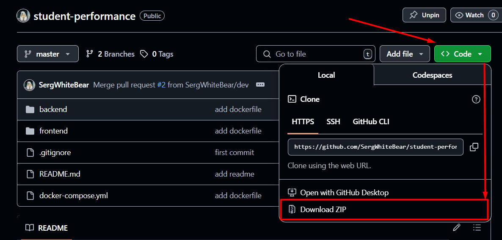

# Student Performance App

Приложение для анализа успеваемости студентов, использующее FastAPI на бэкенде и React на фронтенде.

## 🚀 Быстрый старт

### 1. Клонирование проекта

```bash
git clone https://github.com/SergWhiteBear/student-performance.git
cd student-performance
```

### Или скачать архив с проектом



### 2. Сборка и запуск

#### 2.1 Сборка и запуск Docker-контейнеров

```bash
docker-compose up --build
```

#### 2.2 Локальный запуск


##### Backend

Переходим в папку с backend-ом:

```bash
cd backend
```

Устанавливаем pipenv:

```bash
pip install pipenv
```

Создаем виртуальное окружение с требуемыми библиотеками:

```bash
pipenv install
```

Запускаем сервер:

```bash
make dev
```

##### Frontend

Переходим в папку с frontend-ом:

```bash
cd frontend
```

Устанавливаем зависимости (предварительно должен быть установлена Node Package Manager):

```bash
npm install
```

Запускаем frontend:

```bash
npm start
```

### 3. Доступ к приложениям
#### Frontend: 
```
http://localhost:3000
```
#### Backend API 
```
http://localhost:7000
```
